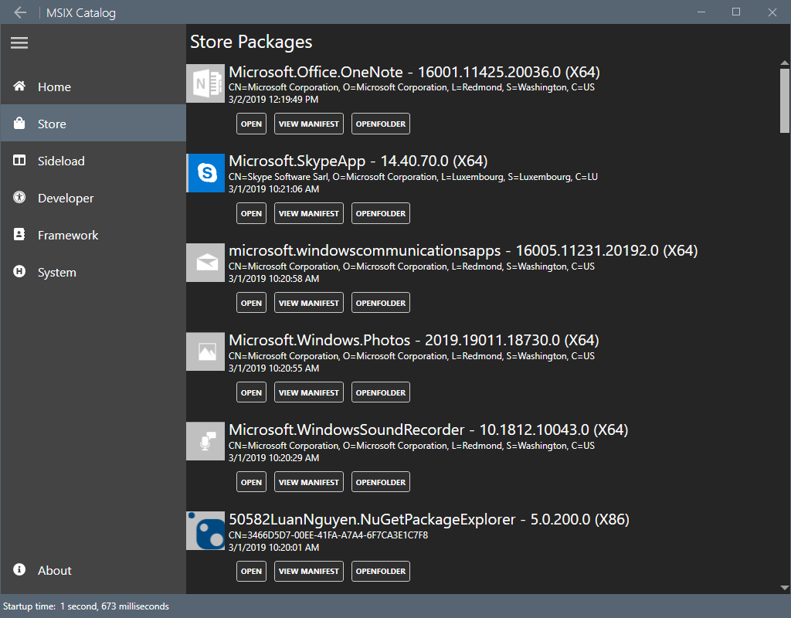

# MSIX Catalog

*WPF application to inspect MSIX/APPX packages deployed in your machine.*

The purpose of this app is to explore different "Desktop Modernization" technologies available to .NET developers: porting from .NET Framework to .NET Core 3, using Win10 APIs, and different deployment techniques.

||.NET Framework 4.7 |.NET Core 3|
|-|-|-|
|Store Release| [Install](https://bit.ly/msix-catalog)| [Install](https://bit.ly/msix-catalog-core)|
|Sideload| [Install](http://msix-catalog.azurewebsites.net/AppxPackages) | [Install](http://msix-catalog.azurewebsites.net/netcore3)|

> All build definitions are available on [Azure Dev Ops Pipelines](https://rido.visualstudio.com/msix-catalog)

## .NET Flavors

The source code is shared between .NET Framework and .NET Core using different project files in the same folder.

## Build Requirements

- .NET Framework 4.6.1
- .NET Core 3.0 Preview (latest)
- Visual Studio 2019 Preview (with Desktop and UWP workloads)
- Windows SDK 1803 (17134 or greater) 

## Experimental 

In addition to MSIX packages, you can get the tool using one of th next alternative installation options:

- [MSIX Catalog from NuGet as global tool](https://www.nuget.org/packages/dotnet-msix-catalog) `dotnet tool install -g dotnet-msix-catalog`
- [MSIX CLickOnce](http://msix-catalog.azurewebsites.net/clickonce/publish.htm)
- [Classic MSI](#)

## Screenshot

